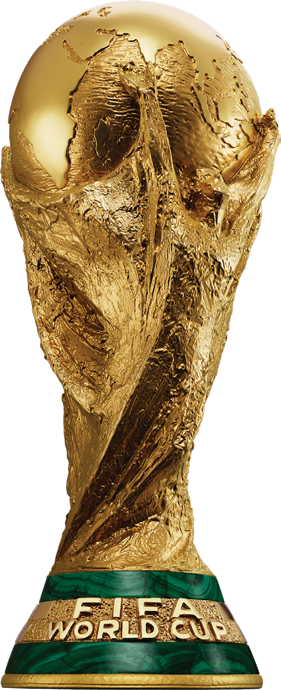
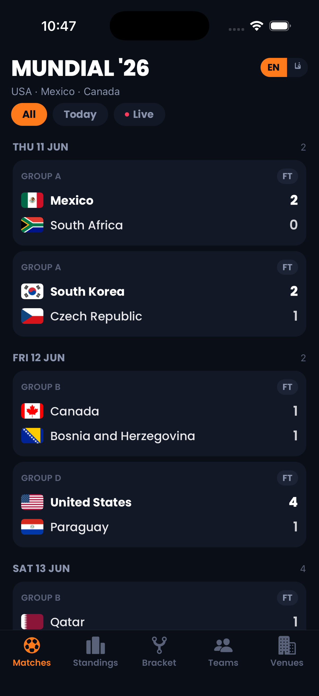
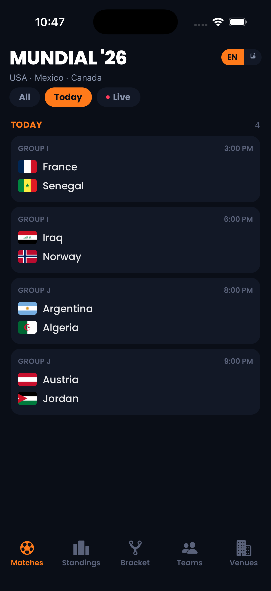
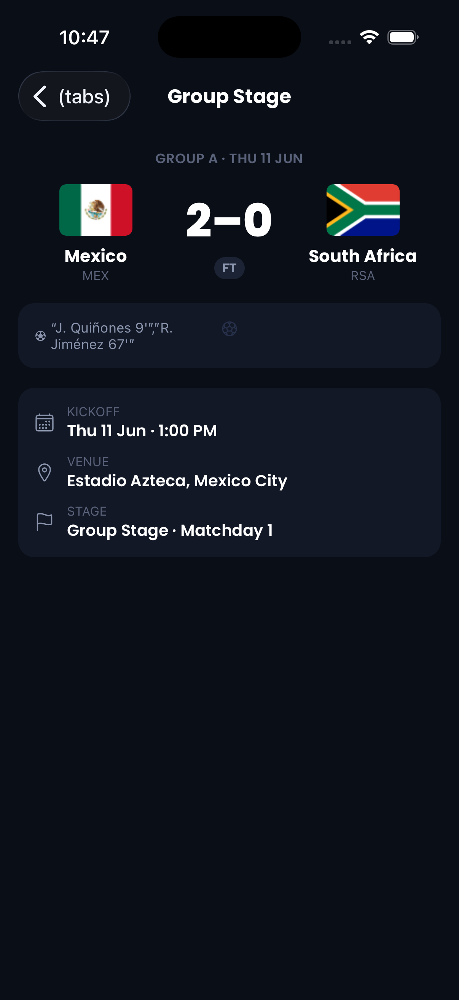
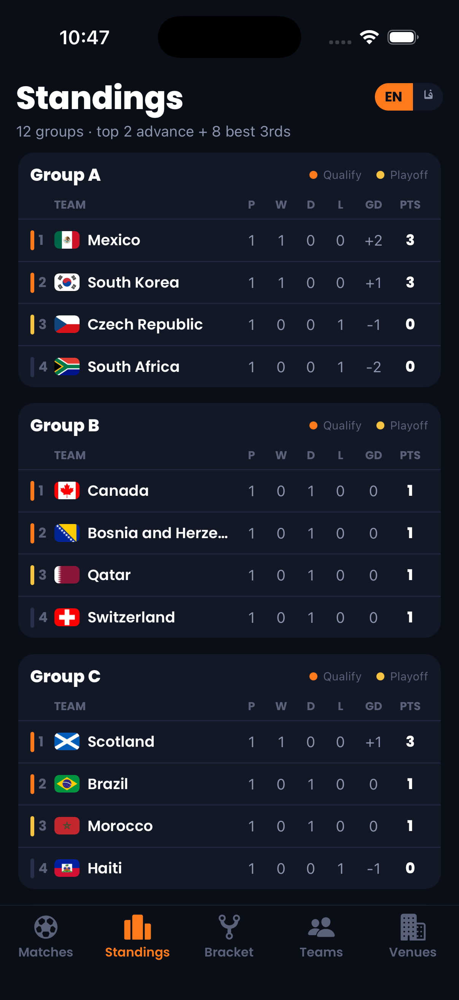
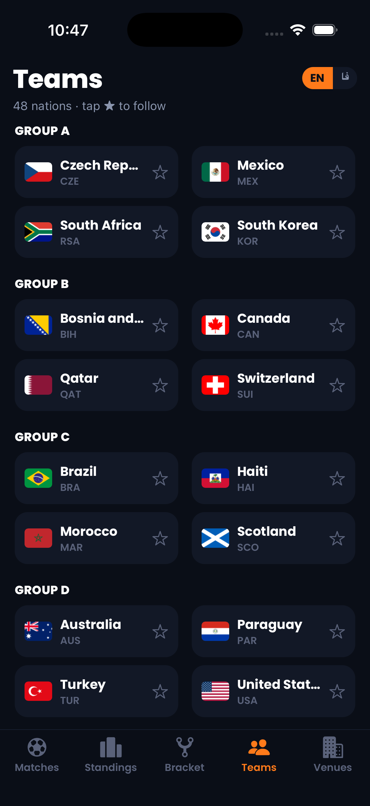
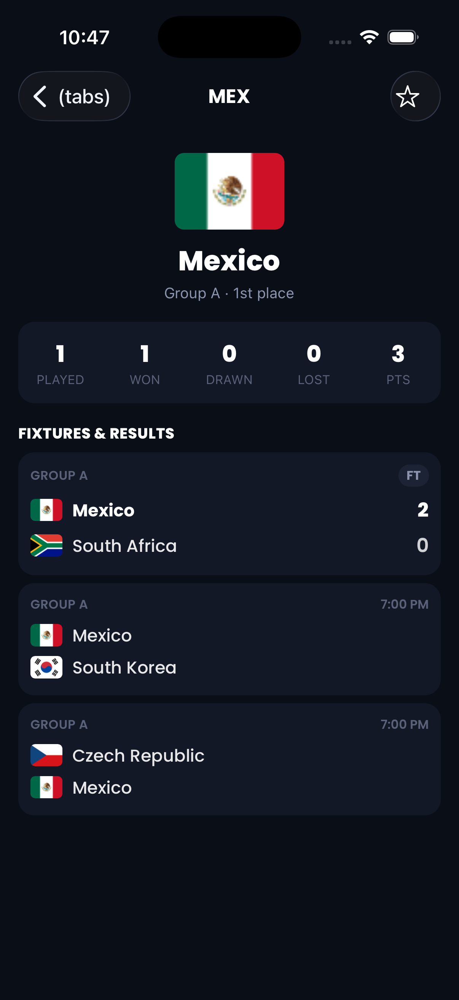
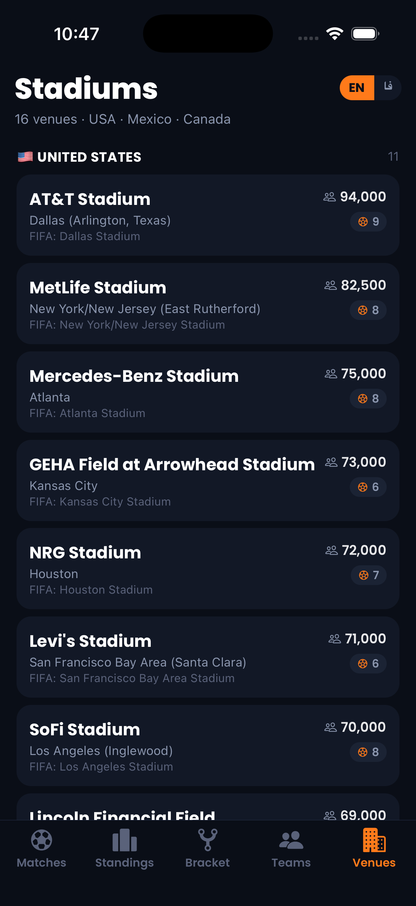
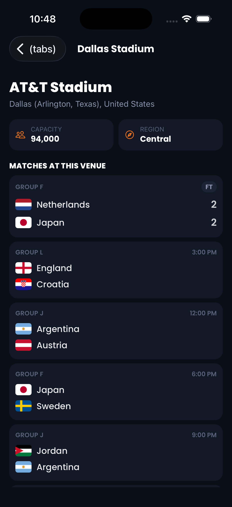

<div align="center">



# MUNDIAL '26

### A free & open-source FIFA World Cup 2026™ companion app

Live scores, group standings, the knockout bracket, all 48 teams and 16 stadiums —
in a fast, dark, mobile-first app built with **Expo + React Native**.

🇺🇸 United States · 🇲🇽 Mexico · 🇨🇦 Canada · June 11 – July 19, 2026

[](https://expo.dev)
[](https://reactnative.dev)
[](https://www.typescriptlang.org)
[](https://www.nativewind.dev)
[](LICENSE)
[](#-contributing)

</div>

---

## 📱 Screenshots

<table>
  <tr>
    <td align="center"><br/><sub><b>Matches</b> — live & date-grouped</sub></td>
    <td align="center"><br/><sub><b>Today</b> filter</sub></td>
    <td align="center"><br/><sub><b>Match detail</b> with scorers</sub></td>
  </tr>
  <tr>
    <td align="center"><br/><sub><b>Standings</b> — 12 groups</sub></td>
    <td align="center"><br/><sub><b>Teams</b> — 48 nations</sub></td>
    <td align="center"><br/><sub><b>Team detail</b> & fixtures</sub></td>
  </tr>
  <tr>
    <td align="center"><br/><sub><b>Stadiums</b> by host nation</sub></td>
    <td align="center"><br/><sub><b>Stadium detail</b> & matches</sub></td>
    <td></td>
  </tr>
</table>

---

## ✨ Features

- ⚽ **Live & date-grouped fixtures** — all 104 matches bucketed by day, with `LIVE` minute badges, `FT` results and goal scorers. Auto-jumps to today.
- 🔴 **Silent live polling** — scores refresh in the background every 30s; the spinner only shows on a manual pull-to-refresh.
- 🔎 **Filters** — `All` · `Today` · `Live`.
- 📊 **Group standings** — all 12 groups (A–L) with qualification colour-coding (top 2 advance + the 8 best third-placed teams).
- 🏆 **Knockout bracket** — Round of 32 → Final, using the API's placeholder labels (e.g. *"Winner Match 86"*) for undecided slots.
- 👥 **48 teams** — browse by group, **follow** your favourites, and open a team page with its group stats and full fixture list.
- 🏟️ **16 stadiums** — venues grouped by host country with capacity and matches-hosted counts, plus a per-venue match list.
- 🌍 **Bilingual** — instant **English / فارسی (Farsi)** toggle for team & stadium names.
- 🎨 **Polished dark UI** — Poppins type, an orange accent, and the FIFA World Cup trophy as the app icon.

---

## 🧱 Tech stack

| Layer | Choice |
|---|---|
| Framework | [Expo](https://expo.dev) SDK 54 · React Native 0.81 · React 19 |
| Navigation | [Expo Router](https://docs.expo.dev/router/introduction/) (file-based) |
| Styling | [NativeWind](https://www.nativewind.dev) (Tailwind for RN) |
| State | [Zustand](https://github.com/pmndrs/zustand) (sliced store) |
| Language | TypeScript (strict) |
| Fonts | Poppins via `@expo-google-fonts` |
| Data | [FIFA World Cup 2026 REST API](https://worldcup26.ir) |

---

## 🚀 Getting started

### Prerequisites

- **Node.js** 18+ and npm
- **Expo Go** on a device, or an iOS Simulator / Android Emulator

### Install & run

```bash
# 1. Clone
git clone https://github.com/andamagodwin/worldcup26.git
cd worldcup26

# 2. Install dependencies
npm install

# 3. Start the dev server
npm run ios       # iOS Simulator
npm run android   # Android Emulator
npm run web       # Browser
npm start         # Pick a target / scan the QR with Expo Go
```

No API key or `.env` is required — the app reads from the public API out of the box.

> [!TIP]
> On a slow connection the first `npm run ios` may stall while Expo Go downloads
> to the simulator. If it times out, pre-install Expo Go once, then re-run.

---

## 🌐 Data source & backend

All tournament data comes from the free, open-source **FIFA World Cup 2026 REST API**:

- 🔌 **API:** <https://worldcup26.ir> · 📖 **Docs:** <https://worldcup26.ir/api-docs>
- 🛠️ **Backend repo:** **[rezarahiminia/worldcup2026](https://github.com/rezarahiminia/worldcup2026)** (Node.js · Express · MongoDB)

Huge thanks to [@rezarahiminia](https://github.com/rezarahiminia) for building and hosting it — ⭐ the backend too!

This app reads from four list endpoints (no auth needed for reads) and does all
filtering/derivation on-device — the dataset is small, so one fetch is fast and resilient:

| Endpoint | Used for |
|---|---|
| `GET /get/games` | Matches, bracket, team & stadium fixtures, match detail |
| `GET /get/teams` | Teams tab, crests & localized names |
| `GET /get/groups` | Standings, team group position |
| `GET /get/stadiums` | Stadiums tab, venue detail, match venues |

Requests are wrapped in retry-with-backoff to ride out the public host's occasional hiccups.

---

## 🏗️ Architecture

The codebase is organized into clear, one-directional layers:
**routes → features → domain (lib) → store → theme**.

```
theme/        Single source of color tokens (shared by Tailwind + RN)
lib/          Pure, framework-free domain logic
  api.ts        Typed REST client (retry/backoff)
  types.ts      API response types
  date.ts       Date parsing & formatting
  match.ts      Match state, scorers, stages
  standings.ts  Sorting & qualification rules
  i18n.ts       EN / FA helpers
  fonts.ts      Poppins loading + global default
  utils.ts
store/        Zustand store, split into slices
  slices/dataSlice.ts          fetching + tournament data
  slices/preferencesSlice.ts   favourites + language
  store.ts                     composes slices
  hooks.ts                     useTournament, useTeam, useLang, useLiveCount…
components/   Shared, cross-feature UI primitives (Screen, Flag, LangToggle)
features/     Self-contained domain modules (UI + view-logic hooks)
  matches/    MatchCard, StateBadge, useMatchSections
  standings/  GroupTable
  teams/      TeamChip, useTeamGroups
  stadiums/   StadiumCard, useStadiumSections
  bracket/    useBracketRounds
app/          Expo Router routes — thin compositions of the above
  (tabs)/     Matches · Standings · Bracket · Teams · Stadiums
  match/[id]  team/[id]  stadium/[id]
```

**Principles**

- **Routes stay thin** — screens compose feature components and call hooks; no business logic inline.
- **Domain logic is pure & testable** — everything in `lib/` is free of React/Expo.
- **One source of truth for color** — `theme/colors.js` feeds both the Tailwind config and native style/icon props.
- **Sliced state** — data and preferences are independent slices behind one `useStore`.

---

## 📜 Scripts

| Script | Description |
|---|---|
| `npm start` | Start the Expo dev server |
| `npm run ios` / `android` / `web` | Run on a target platform |
| `npm run lint` | ESLint + Prettier check |
| `npm run format` | Auto-fix lint & formatting |
| `npm run prebuild` | Generate native projects |

---

## 🗺️ Roadmap

Ideas and PRs welcome:

- [ ] Persist favourites & language with `AsyncStorage`
- [ ] Push notifications for followed teams / kickoff reminders
- [ ] Jalali (Persian) calendar dates when the language is Farsi
- [ ] Full RTL layout for Farsi
- [ ] Match prediction game
- [ ] Home-screen widgets / live activities

---

## 🤝 Contributing

Contributions are very welcome!

1. Fork the repo
2. Create a branch: `git checkout -b feature/amazing-thing`
3. Commit your changes
4. Run `npm run lint` and push
5. Open a Pull Request

---

## 📄 License

[MIT](LICENSE) — free to use, modify and distribute.

> Not affiliated with or endorsed by FIFA. "FIFA World Cup" and related marks are
> trademarks of FIFA; all team flags and tournament data belong to their respective owners.
> This is a fan-made, educational project.

---

<div align="center">
<sub>Built with ⚽ and ☕ · Data by <a href="https://github.com/rezarahiminia/worldcup2026">worldcup2026</a></sub>
</div>
